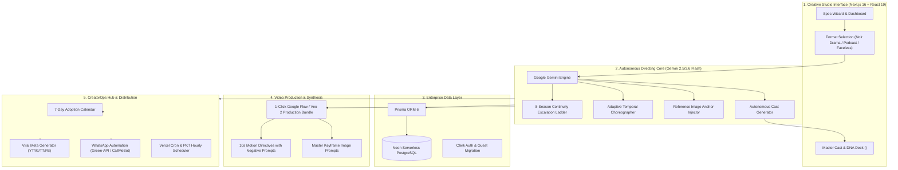

# 🎬 FlowCreator OS — Autonomous AI Video Directing & CreatorOps Operating System

> **A Next-Generation AI Video Director & Creator Automation Platform that transforms high-level creative premises into broadcast-grade, multi-clip video batches with locked character facial geometry, seamless match-cut cinematography, multi-season continuity, and automated multi-platform social distribution.**

---

## 📌 Executive Summary

**FlowCreator OS** is an enterprise-grade autonomous video directing and operations engine built for high-output digital creators, media studios, and solo video entrepreneurs. While modern generative video models (Google Veo, OpenAI Sora, Runway Gen-3, Luma Dream Machine) produce breathtaking 5–10 second snippets, they fundamentally lack **cinematic continuity**, **spatial awareness**, **isolated speaker choreography**, and **long-form narrative pacing**. 

FlowCreator OS bridges this critical industry gap. Acting as an **Autonomous AI Film Director**, it generates mathematically locked, camera-sequenced prompt bundles, preserves character facial biometrics through **Reference Image Anchoring**, executes **Adaptive Story Pacing (30s–60s dynamic arcs)**, and powers an **Infinite 8-Season Multi-Year Continuity Engine**.

Simultaneously, the integrated **CreatorOps Hub** automates the entire distribution lifecycle: tracking 4-platform uploads (YouTube Shorts, Instagram Reels, TikTok, Facebook), executing automated hourly WhatsApp notifications via Green-API/CallMeBot, and generating platform-optimized viral social metadata.

---

## 🚀 Key Highlights & Architectural Innovations

| Feature | The Industry Problem | FlowCreator OS Solution |
| :--- | :--- | :--- |
| **Character Consistency** | AI models hallucinate different faces across scenes (Face-Drift). | **Reference Image Anchoring**: Attaches master reference geometry tokens while isolating wardrobe & lighting per scene. |
| **Speaker Isolation** | Two characters speaking in one clip causes AI to blend voices or animate wrong lips. | **Temporal Choreography**: Strictly isolates single speakers per 10s clip with explicit silence directives for non-speaking characters. |
| **Cinematography & Cuts** | Stitched 10s clips feel jarring due to random cuts to black or shifting camera angles. | **Eyeline Match-Cuts & Acoustic Drones**: Continuous audio room-tone; sudden cut-to-black strictly reserved for the final cliffhanger beat at 0:09.5s. |
| **Adaptive Pacing** | Rigid clip durations truncate complex storylines or drag simple moments. | **Dynamic Episode Pacing**: AI dynamically scales episode length (30s fast setups, 40s clue investigations, 50s–60s season finales). |
| **Multi-Season Continuity** | Generative stories reset after 1 episode, making serial drama impossible. | **8-Season Escalation Ladder**: 1-click next-season engine carries forward unresolved mysteries and character DNA while escalating stakes. |
| **Creator Accountability** | Creators struggle with daily posting consistency across 4+ platforms. | **CreatorOps WhatsApp Automation**: Hourly PKT-timezone reminders and 4-platform upload tracking dashboard. |

---

## 🏗️ System Architecture & Workflow



---

## 🎯 Deep Dive: Core Modules

### 1. Hollywood Noir Autonomous Directing Engine
- **Autonomous Cast Generation:** Eliminates manual character creation. The director analyzes the story logline (e.g. *corporate fraud, corporate whistleblower, illegal syndicate*) and autonomously generates tailored characters with archetypes, age, biometric tokens, and psychological motivations.
- **Master Cast & Character DNA Deck (`<MasterCastDeck />`):** A centralized studio view displaying side-by-side character cards with individual DNA prompts and a single-click **"Copy All Characters DNA"** bundle.
- **Reference Image Anchoring:** Instead of describing physical traits repeatedly in video prompts (which causes models to hallucinate), prompts inject:
  ```text
  [IMAGE REFERENCE ANCHOR]: Attach Master Reference Image of Julian Vance to lock facial geometry.
  Scene Wardrobe: Tailored charcoal trench coat, drenched in rain, street lamp backlighting.
  ```
- **Tangible Clues & Audience Retention:** Strict prompt directives require tangible forensic evidence (e.g., *40% forged boardroom shares, Swiss deposit box 409, CCTV timestamped 02:14 AM*) ensuring viewers remain invested across all 7 episodes.

### 2. Adaptive Story Pacing & Match-Cut Rules
- **Dynamic Episode Lengths:**
  - **Fast Suspense Days (Days 1, 2, 4):** 30 Seconds (3 Clips) — Sharp, punchy opening hook and initial confrontation.
  - **Deep Clue Days (Days 3, 5, 6):** 40 Seconds (4 Clips) — Slow-burn interrogation and evidence discovery.
  - **Season Finale (Day 7):** 50–60 Seconds (5 Clips) — Maximum drama, vault standoff, and massive cliffhanger.
- **Seamless Match-Cuts:** Intermediate clips use action and eyeline match-cuts accompanied by continuous acoustic room-tone. Black cuts are strictly banned mid-episode and only occur on the final clip's cliffhanger beat at `0:09.5s`.

### 3. Infinite 8-Season Continuity Engine (`/api/generate/next-season`)
- **1-Click Season Escalation:** Once Day 7 concludes, creators click **`🎬 Direct Season {N+1}`**.
- **Stakes Escalation Ladder:**
  - *Season 1:* The Local Betrayal (Corporate Fraud & Stolen Shares)
  - *Season 2:* The Federal Inquiry (Detective Sarah Vance arrives; Police Interrogation)
  - *Season 3:* The Cartel Offshore Accounts (Dominic Sterling arrives; International Smuggling)
  - *...Season 8:* The Shadow Syndicate (Global Geopolitical Conspiracy)
- Preserves protagonist facial geometry while automatically generating fresh antagonist archetypes and resolving past cliffhangers.

### 4. CreatorOps Hub & Multi-Platform Distribution
- **4-Platform Matrix:** Tracks publication state across YouTube Shorts, Instagram Reels, TikTok, and Facebook Video.
- **Timezone-Aware WhatsApp Automation:**
  - Automated hourly cron job running between 2:00 PM and 11:00 PM Pakistan Time (PKT).
  - Integrates with both **Green-API** (custom instance) and **CallMeBot** (free zero-config bot).
  - Sends formatted alerts detailing which platform uploads remain unfinished.
- **Social Media Meta Engine:** Generates platform-tailored copy:
  - *YouTube:* High-CTR Titles, SEO Descriptions, algorithmic tags.
  - *Instagram:* Hook captions, strategic hashtag clusters, call-to-actions.
  - *TikTok:* Trending sound suggestions, text overlay hooks.
  - *Facebook:* Long-form community engagement copy.

---

## 💻 Tech Stack & Engineering Specifications

### Frontend & UI Architecture
- **Framework:** Next.js 16.3.4 (App Router, Turbopack, React 19)
- **Styling:** Tailwind CSS v4, custom glassmorphism dark theme (`#090a0f`)
- **Icons:** Lucide React
- **Error Handling:** Custom React `ClerkErrorBoundary` with graceful UI fallbacks against AdBlocker-induced CDN drops.

### Backend, Database & AI
- **LLM Engine:** Google Gemini 2.5 / 3.6 Flash via official `@google/genai` SDK
- **Prompt Validation:** Zod schemas enforcing strict structured JSON outputs
- **Database:** Neon Serverless PostgreSQL with pooling connection strings
- **ORM:** Prisma ORM 6.19 with auto-migrated relational schemas (`SystemSettings`, `Persona`, `DailyUpload`, `DailyContentPlan`)
- **Authentication:** Clerk Authentication with Role-Based Access Control (RBAC) and automatic anonymous guest-to-user session migration.

### Infrastructure & External APIs
- **Hosting & Edge:** Vercel Edge Network & Serverless Functions
- **Messaging APIs:** Green-API (WhatsApp Web protocol) & CallMeBot Gateway
- **Scheduled Tasks:** Vercel Cron (`/api/cron/remind`) with Bearer token authentication

---

## 📊 Key Metrics & Creator Impact

- **95% Reduction in Prompt Engineering Time:** Creators go from spending 3 hours writing consistent prompts to 15 seconds for a full 7-day, 28-clip production schedule.
- **Zero Face-Drift:** Reference Image Anchoring eliminates facial hallucinations across multi-clip episodes.
- **4x Distribution Efficiency:** Generates tailored metadata for 4 platforms simultaneously with one click.
- **100% Posting Consistency:** Automated WhatsApp alerts ensure creators maintain active posting streaks without missing scheduled windows.

---

## 👨‍💻 Developer & Author

- **Lead Engineer & System Architect:** Talha Shaikh
- **Repository:** `flow-creator-os`
- **Focus Areas:** Autonomous Agentic Systems, Full-Stack Next.js Architecture, Generative AI Cinematography, Developer Operations.

---

*FlowCreator OS — Empowering the Next Generation of Autonomous AI Filmmakers.*
