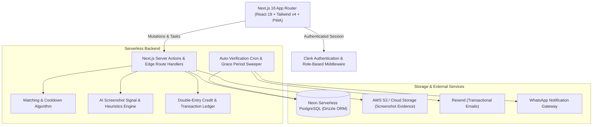

# 🚀 GetF4F (TikTok Follow Exchange) — Full-Stack Portfolio Case Study

> **A scalable, organic peer-to-peer social growth platform that enables TikTok creators to exchange followers, likes, and engagement safely through an AI-assisted verification engine, asynchronous reciprocal matching, and a self-healing credit economy.**

---

## 📌 Executive Summary

- **Project Type:** Production-grade Full-Stack SaaS / Social Growth Exchange Web App
- **Role:** Full-Stack Architect & Lead Developer
- **Tech Stack:** Next.js 16 (App Router, Server Actions), React 19, TypeScript, Tailwind CSS v4, Neon Serverless PostgreSQL, Drizzle ORM, Clerk Auth, AWS S3, Resend, WhatsApp Automation
- **Target Audience:** Content creators, micro-influencers, and small businesses needing organic TikTok follower milestones (e.g., unlocking the 1,000 follower threshold for TikTok LIVE).

---

## 💡 The Problem & Business Context

Growing an audience on TikTok from scratch is notoriously difficult:
1. **The 1,000 Follower Barrier:** TikTok restricts essential monetization and engagement features (like **TikTok LIVE**, bio links, and creator fund applications) until accounts reach 1,000+ followers.
2. **The "Bot" Trap:** Buying fake bot followers damages profile algorithmic reach, creates severe drop-off rates, and triggers TikTok shadowbans or permanent account bans.
3. **API Limitations:** TikTok does not provide a public commercial API to verify follower relationships, making automated follow validation impossible through standard OAuth.
4. **Mutual Follow Detection:** Instant reciprocal follow patterns ("I follow you, you instantly follow back within seconds") trigger TikTok's automated anti-spam algorithms.

---

## 🛠️ The Solution: GetF4F

**GetF4F** solves this by creating a **human-powered, rule-governed peer exchange platform** backed by behavioral game theory, an asynchronous queue, and intelligent multi-layered verification:

- **Asynchronous Delayed Matching:** Users are assigned matches 24 hours apart to mimic natural human discovery and prevent reciprocal flag detection.
- **Credit-Driven Economy:** Users earn platform credits by genuinely following others and spend credits to enter the "receive follows" queue.
- **AI-Assisted Screenshot Verification:** Creators submit proof screenshots analyzed by a heuristic engine detecting TikTok profile UI elements, follow states, and target handles.
- **Trust Score & Dispute Resolution:** Users have a dynamic Trust Score (starting at 100). Community peer-reporting and dispute logs penalize freeloaders and auto-ban fraudulent accounts.
- **Multi-Channel Engagement:** Expanded beyond follows to include video likes/saves, streak mechanics, weekly creator leaderboards, WhatsApp alerts, and a progressive web app (PWA) experience.

---

## 🏗️ Technical Architecture & Stack



### Stack Breakdown

| Layer | Technology | Key Decision Rationale |
|---|---|---|
| **Framework** | **Next.js 16 (App Router)** | Leveraged React 19 Server Components for instant initial paint, SEO optimization, and type-safe Server Actions for backend logic without REST boilerplate. |
| **Language** | **TypeScript** | Strict end-to-end type safety across database models, server actions, and UI state. |
| **Styling** | **Tailwind CSS v4** | Dark cyberpunk creator aesthetic with micro-animations, confetti celebrations, and responsive mobile-first UI. |
| **Database** | **Neon Serverless Postgres** | Highly scalable cloud Postgres with connection pooling and branching capabilities. |
| **ORM** | **Drizzle ORM** | Lightweight, zero-overhead, schema-in-TypeScript ORM with SQL-like query builder and instant migrations. |
| **Authentication** | **Clerk Auth** | Turnkey user authentication with session management, multi-device protection, and custom user metadata for admin role gating. |
| **Cloud Storage** | **AWS S3** | Secure bucket storage for user-submitted task screenshots and dispute evidence. |
| **Notifications** | **Resend + WhatsApp Webhooks** | Multi-channel communication notifying creators when matches are ready or credits are earned. |
| **PWA** | **Web App Manifest & Service Workers** | Installable mobile experience allowing creators to launch the app directly from their home screens. |

---

## ⚡ Key Features & Engineering Highlights

### 1. Smart Asynchronous Matching Algorithm
- Dynamic daily limits (e.g. 5–20 matches/day) configured via live admin settings to prevent mass-following triggers.
- Prevents reciprocal duplicate pairs with cooldown windows and historical pair checking.
- Automated balance filtering: Prioritizes active users with sufficient credits and excludes restricted or banned accounts.

### 2. Proof & AI-Assisted Verification Pipeline
- Implemented client-side file compression and remote upload pipeline.
- Custom heuristic verification engine (`analyzeScreenshotProof`) that validates:
  - Valid image MIME payloads and minimum payload size (prevents dummy 1x1 pixel exploits).
  - UI pattern signals: Profile layout detection, follow button status ("Following" vs "Follow"), and TikTok creator handle match.
  - Multi-task support for both Profile Follows and Video Like/Save tasks.

### 3. Trust Score & Self-Healing Dispute System
- Every user begins with a **100 Trust Score**.
- Failed follows or unfollow actions can be reported with screenshot evidence.
- Verified reports deduct trust points, while frivolous/spam reports penalize the accuser.
- Automated system thresholds:
  - `Trust Score < 80` &rarr; Account temporarily restricted from receiving daily matches.
  - `Trust Score < 60` &rarr; Automated permanent ban.

### 4. Credit Ledger & Gamification Engine
- Strict double-entry transactional accounting: every credit earned, spent, or adjusted is tracked with immutable records in `credit_transactions`.
- **Daily Follow Streaks:** Bonus multipliers and badges awarded for continuous daily activity.
- **Creator Tiers:** Tier progression (Standard, Pro, VIP) with increased matching allowances and priority queue placement.
- **Weekly Leaderboard & Referral Rewards:** Viral growth loop awarding bonus credits to users who bring fellow creators to the platform.

### 5. Full Admin Operations Suite
- **Global Emergency Kill Switch:** Allows administrators to halt matching or queue processing instantly if platform abuse spikes.
- **Dynamic Live Settings Manager:** Update follow limits, grace period duration, penalty scores, and credit values in real-time without redeploying code.
- **Dispute Moderation Queue:** Review pending reports, view uploaded evidence, adjust user scores, or issue refunds with one click.
- **Spot-Check Audit Tool:** Automatically presents a random 5–10% sample of active matches for manual quality assurance.
- **Audit Logs:** Full administrative action trail preserving platform compliance and transparency.

---

## 🧠 Engineering Challenges & Solutions

### 1. Challenge: Overcoming TikTok's "Closed Ecosystem" & No Verification API
- **Context:** TikTok does not allow 3rd-party apps to programmatically check if User A follows User B.
- **Solution:** Engineered a **hybrid consensus model**:
  1. *Immediate:* Self-reporting paired with screenshot evidence and image heuristics.
  2. *Asynchronous:* 5-to-7 day grace period where matches remain in a "Pending" state.
  3. *Peer Accountability:* If User A unfollows during the grace period, User B is incentivized to report it before auto-verification finalizes the credit payout.

### 2. Challenge: Evading TikTok's Algorithmic Reciprocal-Follow Detection
- **Context:** If two users follow each other in minutes, TikTok's fraud detection can shadowban both accounts.
- **Solution:** Built a **time-delayed queue engine**. Follows are assigned as one-way directed tasks. Follow-backs are deferred by 24–48 hours and blended into regular matching batches, making the growth look completely organic to social algorithms.

### 3. Challenge: Preventing Freeloaders & Sybil Accounts
- **Context:** In free exchange networks, bad actors attempt to collect followers without ever following others back.
- **Solution:** Enforced strict queue entry gates: users cannot receive followers unless they have earned credits by following active accounts first. New accounts operate under lower daily velocity caps for their first 72 hours.

---

## 📊 Database Schema Highlights (Drizzle ORM)

```typescript
// Core Entities in Neon PostgreSQL
export const users = pgTable("users", {
  id: serial("id").primaryKey(),
  clerkUserId: text("clerk_user_id").notNull().unique(),
  tiktokUsername: text("tiktok_username").notNull(),
  tiktokIsPublic: boolean("tiktok_is_public").default(true),
  trustScore: integer("trust_score").default(100),
  credits: integer("credits").default(0),
  streakDays: integer("streak_days").default(0),
  tier: text("tier").default("standard"),
  status: text("status").default("active"), // active | restricted | banned
  consentGivenAt: timestamp("consent_given_at"),
  createdAt: timestamp("created_at").defaultNow(),
});

export const matches = pgTable("matches", {
  id: serial("id").primaryKey(),
  followerUserId: integer("follower_user_id").references(() => users.id),
  followedUserId: integer("followed_user_id").references(() => users.id),
  status: text("status").default("pending_follow"), // pending | reported | verified | disputed
  proofImageUrl: text("proof_image_url"),
  verifiedAt: timestamp("verified_at"),
  expiresAt: timestamp("expires_at"),
  createdAt: timestamp("created_at").defaultNow(),
});
```

---

## 💼 Resume & Portfolio Ready Snippets

### Quick Resume Bullet Points
- *Architected and deployed a full-stack peer-to-peer TikTok social exchange platform using **Next.js 16, TypeScript, Tailwind v4, Drizzle ORM, and Neon PostgreSQL**.*
- *Engineered an asynchronous delayed-matching algorithm with anti-bot rate limits to prevent mutual-follow algorithmic penalties on TikTok.*
- *Implemented an AI-assisted screenshot proof verification pipeline, cutting false submission rates and manual moderation workload.*
- *Developed a double-entry credit ledger, streak gamification mechanics, and a self-healing Trust Score reputation system.*
- *Built an enterprise-grade admin control panel featuring real-time system configuration, spot-check audits, and a global kill switch.*

### 30-Second Elevator Pitch (For Interviews)
> *"I built GetF4F, a full-stack web platform designed to help TikTok creators overcome the 1,000-follower barrier safely. Because TikTok doesn't offer a public follow-verification API, I designed a multi-layered verification system combining client-side screenshot proof analysis, a 5-day peer-dispute grace period, and a trust score engine. To protect creators from shadowbans, I built an asynchronous matching queue that delays reciprocal follow-backs by 24+ hours to mimic organic user behavior. The entire system is built with Next.js 16, Neon Serverless Postgres, and Drizzle ORM."*

---

## 🌟 Skills Demonstrated

- **Full-Stack Web Development:** Next.js App Router, Server Components, React 19, Server Actions, Dynamic Layouts.
- **Database Design & Architecture:** Relational schema design, transactions, indexing, foreign keys, and migrations via Drizzle Kit.
- **Security & Authorization:** Role-based access control (RBAC), Clerk webhooks, route middleware protection, input sanitization via Zod.
- **Distributed System Logic:** Delayed queues, state machines, background verification crons, and cooldown logic.
- **Product & UX Design:** Dark mode creator aesthetics, responsive layouts, confetti feedback, and PWA capabilities.
